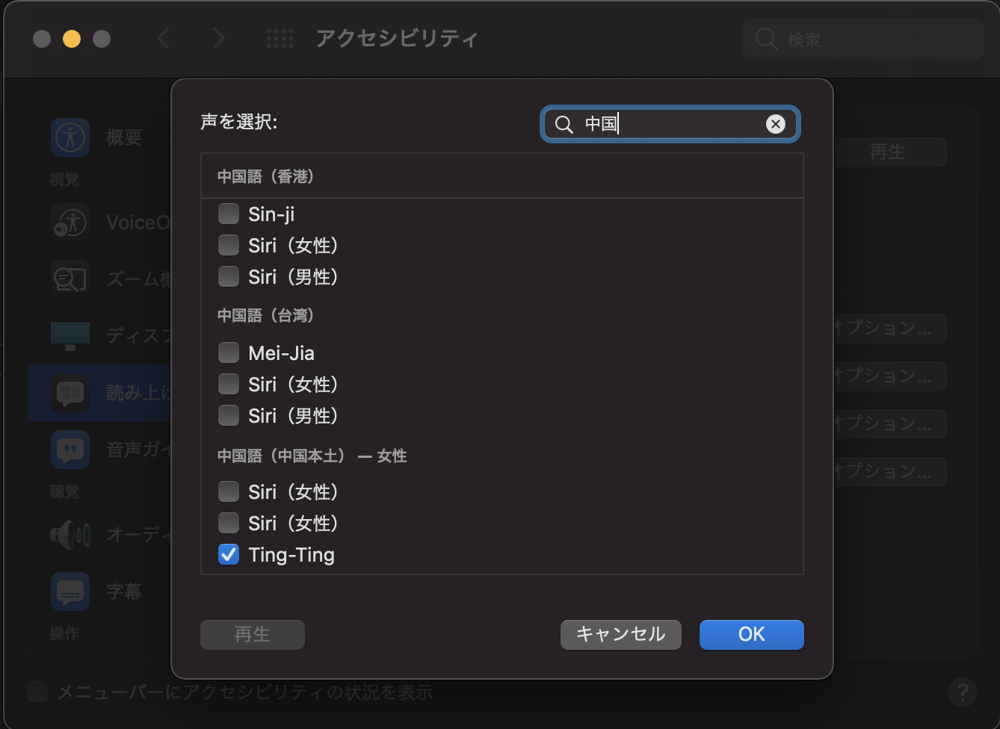

# Piny

**HSK** (漢語水平考試) word memorization tool with CLI,  
and can learn vocabulary and pinyin efficiently.


## Usage
Preparation: Install [Deno](https://deno.land/manual/getting_started/installation), and download this repository.
```bash
$ deno run --allow-read ./piny-cli.ts
```
### Index file
By creating a bookmark file, you can start from the middle.
```bash
# Ex: 8th of HSK3
$ echo 'HSK3-8' > dict/dict.idx
```

### Customize
Customization is possible by placing your dictionary file.  
Format is CSV:  
**[number, 汉语, pinyin, mean, index(start line key)]**
```csv
1,阿姨,āyí,叔母さん,HSK3-1
2,啊,a,はい，ええ,HSK3-2
3,矮,ǎi,短い,HSK3-3
...
```
> Dictionary origin files: <https://12daimedaimonya-chinese.com/hsk-word-download/>

## Listening using Say
`Preferences > Accessibility > Speech`, clicking the voice selector and in there Customize.  
Download "Ting-Ting" voice.


```bash
$ npm install -g say
$ deno run --allow-read --allow-run=/usr/bin/say ./piny-cli.ts --say
```
> Notice: --allow-run, It may become unusable in the future.  
> refs: <https://github.com/denoland/deno/issues/3378>

## Recording the result (Experimental feat)
The results are stored in the `records/` directory.
```bash
$ deno run --allow-read --allow-write --allow-run=/usr/bin/say ./piny-cli.ts --say --record
```
